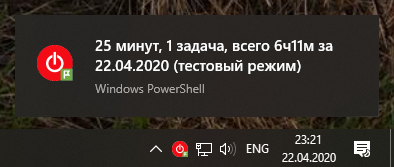

# Planfix-Toggl server

Интеграция Planfix и Toggl, отправляет данные из Toggl в Планфикс, сделан для того, чтобы избавить людей,
трекающих свою активность в Toggl, от ручного переноса данных в Планфикс.

Вольное описание в [блоге](http://blog.popstas.ru/blog/2018/03/01/planfix-toggl-integration/), конкретное - ниже.

## Установка
1. Скачайте последний релиз:
   [Windows](https://github.com/viasite/planfix-toggl-server/releases/download/0.8.5/planfix-toggl-windows.zip), [Linux](https://github.com/viasite/planfix-toggl-server/releases/download/0.8.5/planfix-toggl-linux.zip), [MacOS](https://github.com/viasite/planfix-toggl-server/releases/download/0.6.4/planfix-toggl-darwin.zip)
2. Установите сертификат certs/server.crt в систему как доверенный корневой, [подробнее](certs/)
3. Запустите planfix-toggl-server.exe
4. Откроется веб-интерфейс, [заполните настройки](#настройка), нажмите все кнопки "Проверить"
5. Перезапустите приложение

#### Расширение для браузера
Расширение добавляет кнопку Toggl в задачи Планфикса.   

После установки появится окно, в котором нужно найти planfix и поставить галочку напротив него.

Установить для [Chrome](https://chrome.google.com/webstore/detail/toggl-button-planfix-edit/hkhchfdjhfegkhkgjongbodaphidfmcl), [Firefox](https://addons.mozilla.org/ru/firefox/addon/toggl-button-planfix/).

#### Видео установки и настройки
Когда будут проблемы, посмотрите видео с настройкой с нуля: настройка отправки через Planfix API, расширение, создание аналитики - https://www.youtube.com/watch?v=0Ou0FX2Z1L0

#### Linux
На Ubuntu я когда-то проверял, должно работать, Ubuntu у меня есть, могу поправить, если будут пользователи.

#### MacOS
На MacOS никогда не проверял, вряд ли заработает.
Последняя версия, которая собиралась на MacOS - [0.6.4](https://github.com/viasite/planfix-toggl-server/releases/download/0.6.4/planfix-toggl-darwin.zip),
после этого была добавлена иконка в трей, которую проблематично компилировать под макось, а у меня нет мотивации это делать (сижу на Windows).

## Настройка
Видео настройки выше.

Настройки рекомендуется делать через веб-интерфейс (там Меню - Настройки).

#### Способы отправки аналитик в задачи
Есть два способа отправки данных в Планфикс: через email и через Планфикс API.

Если у вас платный аккаунт, используйте вариант с API.

Вариант с отправкой email потенциально ненадёжен. Он тестировался 4 дня, вариант с API используется в работе с 2018 года.

При настройке через email надо дополнительно [настроить правила обработки](#настройка-планфикса-для-обработки-email).

## Как это работает
При запуске Toggl-задачи через расширение Toggl-Planfix Вы должны указывать записям в Toggl id задач Планфикса в виде тегов, например, 12345.

При запуске скрипт получает последние 50 записей, находит среди них записи с номерами задач и отправляет туда аналитику.
Если из 50 записей нашлось, что отправить, запрашиваются следующие 50 записей, так может продолжаться до 1000 записей (20 страниц).

После успешной отправки к записи добавляется тег `sent`, чтобы не отправить повторно.

Если запустить уже отправленную запись toggl, из нее в течение минуты будет автоматом стерт тег `sent`.
Это нужно, чтобы можно было возобновлять задачи из Toggl, тогда в них уже будет тег задачи.

Записи в Toggl, сделанные не вами (в командном аккаунте) игнорируются.

При отправке записи группируются, то есть если отправлять раз в час и за это время 3 раза начинать и останавливать одну задачу,
то в итоге будет отправлена только 1 аналитика, в которой суммируется время 3 отрезков.

#### Файлы конфигурации
Под капотом настройки хранятся в `config.yml`, пользователи должны править только его.

В конфиге `config.default.yml` указаны некоторые настройки по умолчанию, все они могут быть переопределены в `config.yml`.

Настройки для всех:

- `togglSentTag` - тег, которым помечаются отправленные toggl-записи
- `togglApiToken` - токен Toggl, в настройках profile в Toggl
- `togglWorkspaceId` - посмотрите в url вашего workspace в Toggl
- `planfixAccount` - поддомен вашего Планфикс аккаунта
- `sendInterval` - период отправки данных в Планфикс, в минутах

Настройки для отправки через email:

- `smtpHost`, `smtpPort`, `smtpSecure` - настройки SMTP для отправки. Нужно настроить на свой рабочий ящик, который связан с аккаунтом в Планфиксе
- `smtpLogin`, `smtpPassword` - логин и пароль от вашей почты (настройки по умолчанию для Яндекс почты)
- `smtpEmailFrom` - должен совпадать с email вашего аккаунта в Планфиксе и у smtp должно быть право отправлять письма от этого имени
- `planfixAnaliticTypeValue` - как называется поминутная аналитика, которую вы хотите проставлять в Планфикс
- `planfixAuthorName` - ваше Имя Фамилия в Планфиксе

Настройки для отправки через Планфикс API:
- `planfixApiKey` - приватный API ключ, есть у владельца аккаунта Планфикса
- `planfixApiUrl` - URL API, для аккаунтов в России он будет другим
- `planfixUserName`, `planfixUserPassword` - ваши логин и пароль в Планфиксе

Также, нужно описать все поля аналитики, которые будут заполняться:

Переменная в конфиге | Что в него надо вписать
---|---
`planfixAnaliticName` | Название аналитики, например, `Выработка`
`planfixAnaliticTypeName` | Название поля выбора записи справочника, например, `Вид работы`
`planfixAnaliticTypeValue` | Название записи справочника из предыдущего поля, измеряемой в минутах, например, `Поминутная работа программиста`
`planfixAnaliticCountName` | Название поля количества, сюда будет попадать кол-во минут, например, `Количество`
`planfixAnaliticCommentName` | Название поля комментария, сюда будет попадать название toggl записи
`planfixAnaliticDateName` | Название поля даты (день, без времени)
`planfixAnaliticUsersName` | Название поля сотрудника (мультиполе сотрудников)

Для осторожных: все данные, включая пароли, отправляются только на `planfixApiUrl` и в Toggl, все исходники открыты.

Прочие настройки:
- `debug` - включает больше вывода (которого и без того много)
- `logFile` - лог, туда отправляется все то же, что и в консоль
- `dryRun` - тестовый режим, без реальной отправки данных в Планфикс

### Настройка Планфикса для обработки email
Управление аккаунтом -> Работа с помощью e-mail -> Правила обработки для задач -> Новое правло

У вас будут другие названия полей, если вы не работаете в [Viasite](https://viasite.ru).

#### Параметры отбора:
- Тема письма содержит текст: `@toggl`
- Содержание письма содержит слово: `time:`
#### Операции:
- Добавить аналитику: Выработка
- Вид работы: `Вид работы:` (до конца строки)
- Дата: `Дата:` (до конца строки)
- Кол-во: `time:` (до конца строки)
- Сотрудник: `Автор:` (до конца строки)
#### Также
- Удалить всё, начиная с метки: `Вид работы:` (в содержании письма)
